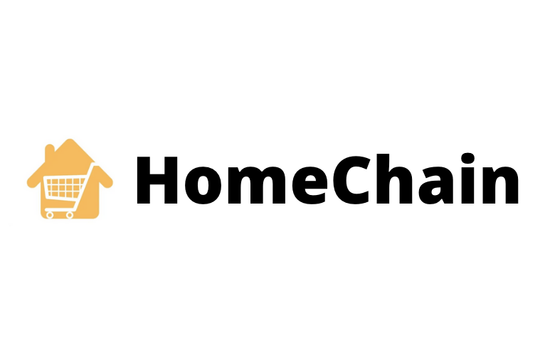
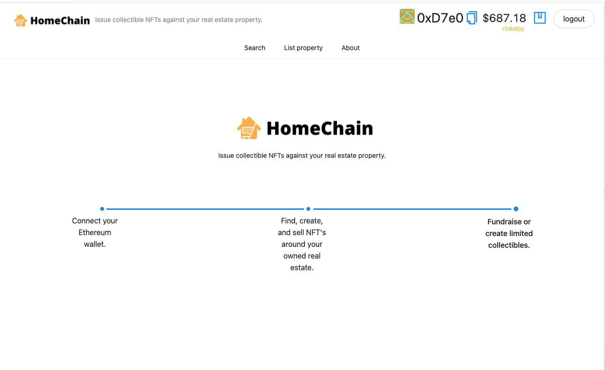
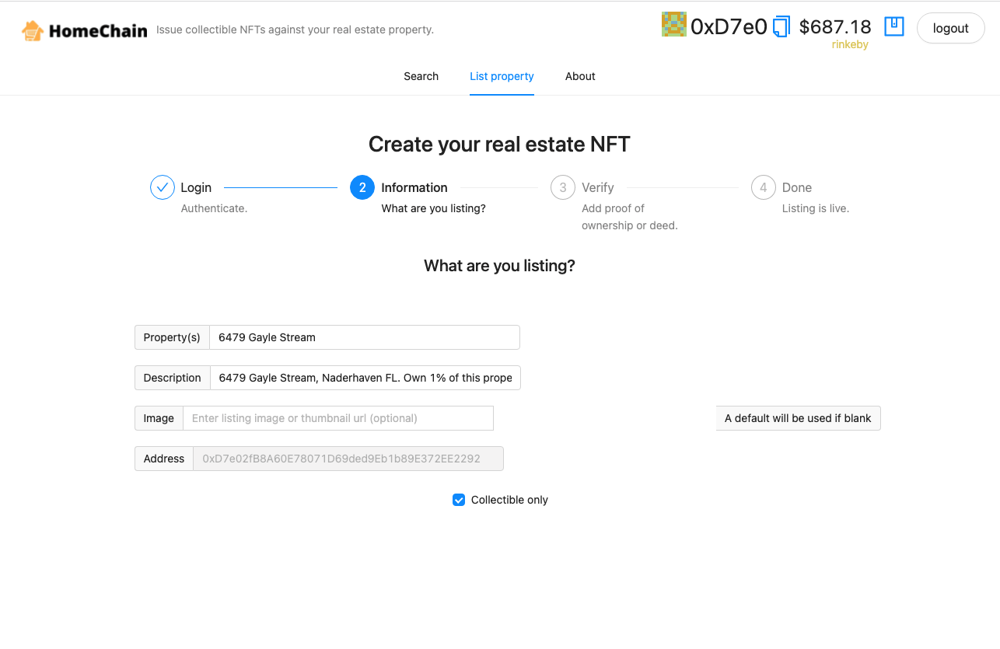
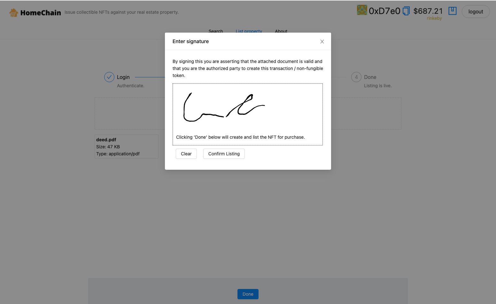
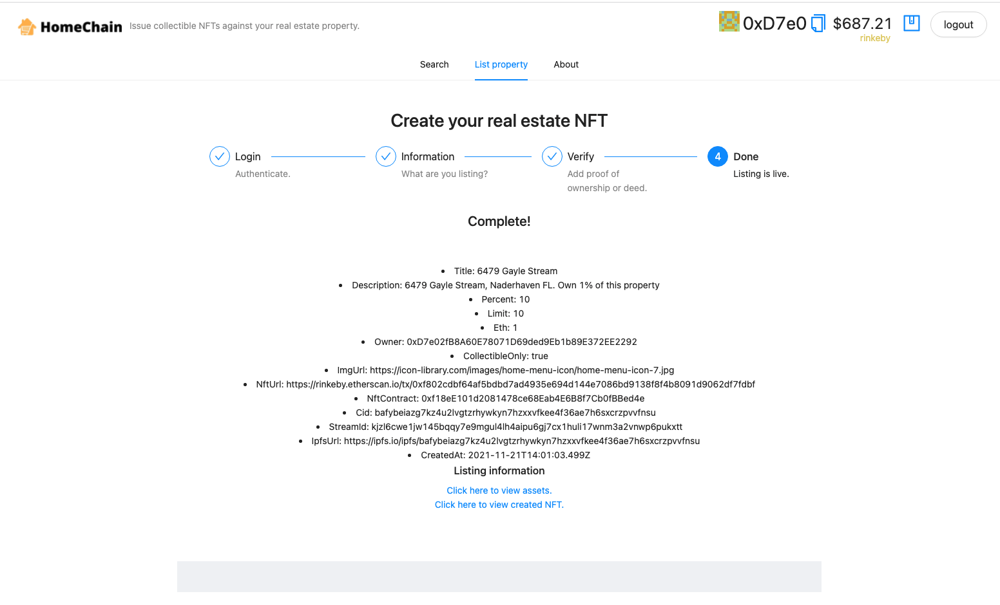
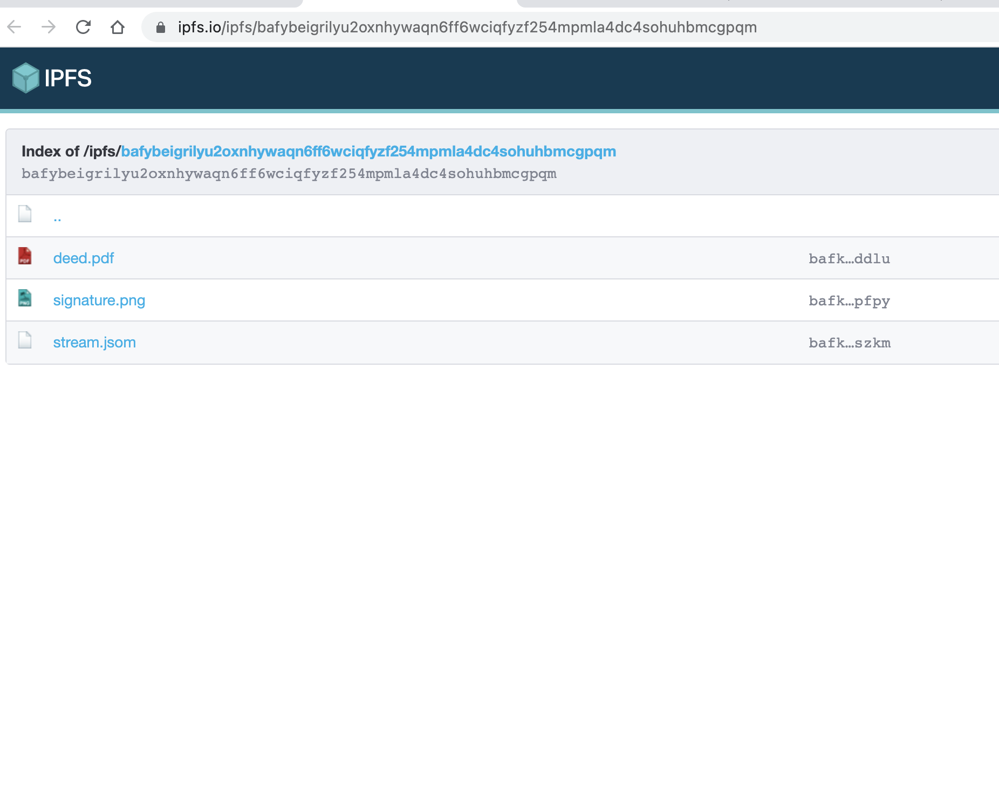
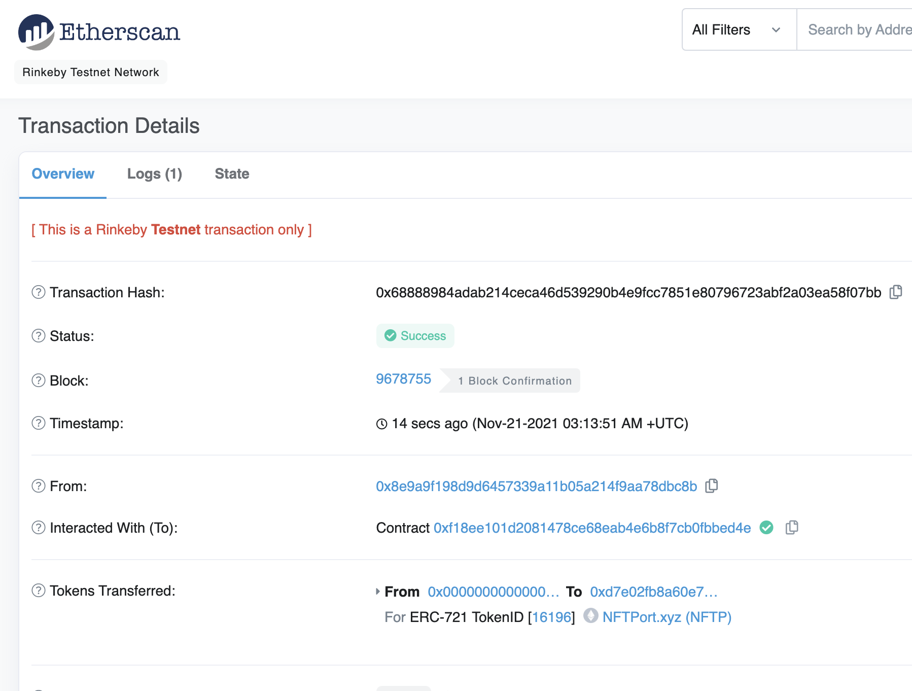
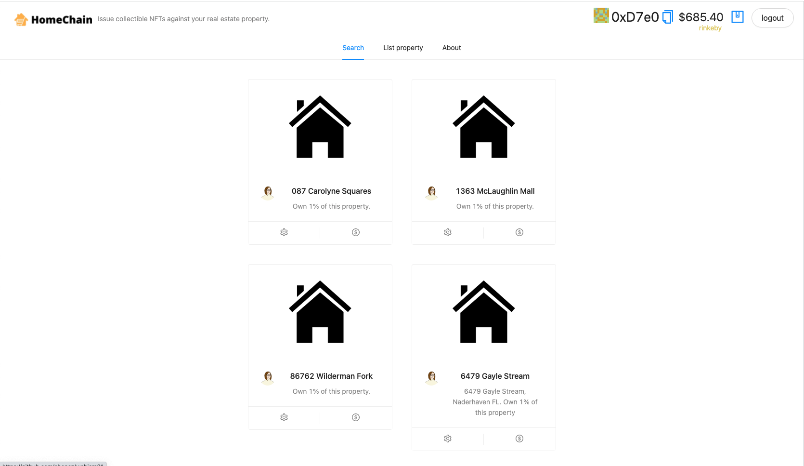
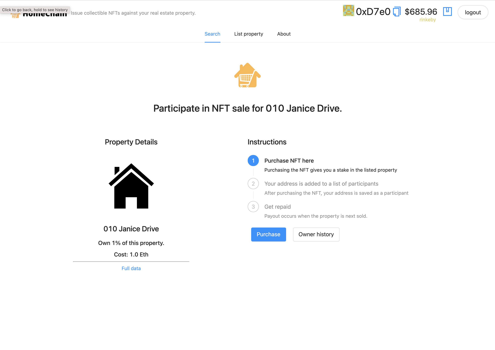
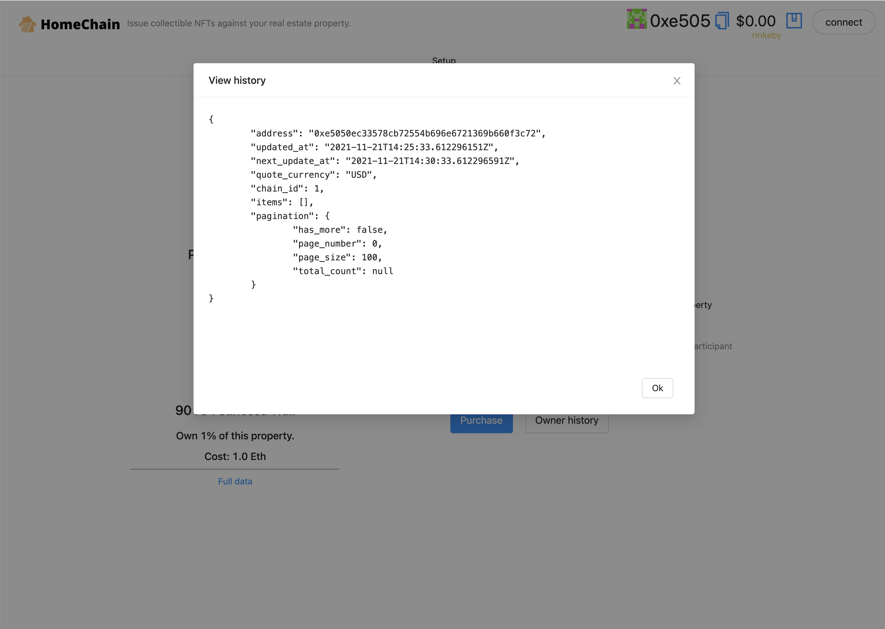

<p align='center'>
    
</p>

## HomeChain

Find, create, and sell NFT's around your owned real estate.

### Motivation

There's been talk to use blockchain to enable rapid transactions, partial sales, and better auditing of real estate, but in practice this can be difficult.

One of the biggest problems is transferring and representing ownership of real estate is ensuring governance:

- Who enforces that the ownership is represented by this particular NFT?
- If ownership is distributed, who is responsible for maintaining the property?
- How are duplicate or unauthorized NFT's avoided?

HomeChain enables users to create either own NFT's around properties they own:

* Filecoin for property signature and proof of ownership (document) storage.
* React for file upload and signature collection
* Ceramic streams for noSQL store of the property, links to the NFT.
* NFTport for NFT generation against the same entity.
* Covalent for doing in-app lookups of address history around an owner or property listing.

- Users can create terms to allow others to deposit to it.
- Use react signature canvas to collect the user signature (checking against the deed) and uploading as an image file to the IPFS folder for the property.
- After being uploaded, prospective buyers/participants (up to the limit specified by the issuer) can discover those listings and purchase units of ownership using attachment the NFT as a source of truth.
- Property NFT's uploaded can either be ownership-oriented or simply collectible (i.e. could be used in the case of a celebrity or notable location).

<p><b>Note this app is a prototype and would need additional work to be production ready.</b></p>

### Requirements

HomeChain has the following environment requirements:

<pre>
REACT_APP_NFT_PORT_KEY=XXX # your nftport.xyz api key.
REACT_APP_STORAGE_KEY=XXX  # your web3.storage api key.
REACT_APP_COVALENT_KEY=XXX # your covalent key.
</pre>

Sponsors:
Ceramic: Distributed mutable data storage for the marketplace metadata. Search support.
IPFS / Filecoin: Store associated files, signature, and proof of ownership (ex: deed/title).
NFTPort: NFT issuance for the issued real estate backed NFT (minting).
Unlock protocol: NFT purchase / paywall. Once an NFT is uploaded, unlock protocol regulates access via required payment.
Covalent: Used for accessing and presenting the transfer and ownership history for a particular contract or property. Note covalent use in app is connected to mainnet by default (rinkeby not supported.)

<!--
Tap into the equity of your home.
-->

Related links: https://www.forbes.com/sites/nataliakarayaneva/2021/04/08/nfts-work-for-digital-art-they-also-work-perfectly-for-real-estate/?sh=775f435e43f3

### Screenshots

#### Home page



#### Creating a new listing



#### Signature and proof of ownership document required for listing



#### Completed upload



#### Uploaded IPFS content (deed and signature)



#### NFT created on upload



#### Once listed, property is available or search



#### Property details page



#### Owner history of a property



#### Participate in a listed NFT sale


<!--

ex:
https://rinkeby.etherscan.io/tx/0x68888984adab214ceca46d539290b4e9fcc7851e80796723abf2a03ea58f07bb
https://ipfs.io/ipfs/bafybeigrilyu2oxnhywaqn6ff6wciqfyzf254mpmla4dc4sohuhbmcgpqm
---
Chainlink
Moralis
Filecoin

Demo flow:
* Stat/web news about home/housing market
* NFT platforms for real estate exist, but one of the biggest problems is governance.
* Capped out at 10%, can't relinquish more than that.
* Ex: 1.0 eth per 1% ownership (10 max percent, 10 participants), // effective default is 1 eth for 1% ~4k, ~400k net valuation.
* Create form flow having person upload proof of ownership of home
* Create terms to allow others to deposit to it
* Use react signature canvas to collect the user signature (checking against the deed) and uploading as an image file to the IPFS folder for the property.
* Show completion page (ceramic stream, ipfs folder, and nftport-created NFT).
* After being uploaded, prospective buyers/participants (up to the limit specified by the issuer) can purchase units of ownership around the NFT.
* Property NFT's uploaded can either be ownership-oriented or simply collectible (i.e. could be used in the case of a celebrity or notable location).
* Generate NFT after form completion
* Uploaded proof of ownership
- The technology here could be leveraged for other esignature purpsoes as well (beyond real estate), where you want to esign a document and have the signature tied to the document in a filecoin directory.
- This actually serves that purpose but with a self-signed title document.
* API call from chainlink to get house price estimate.
* Login (powered by moralis).
* Search listings (backed by moralis).

Create a limited partnership (LP), issue a token on whatever blockchain you want. Make the bylaws of the LP state that ownership and voting rights for LP is dictated by ownership of said token. Transfer ownership of one or more pieces of real estate to the LP. Whether a single home or bundle. Now you have this LP which owns one or more assets, and you can transfer around ownership of the LP itself by just sending tokens around.

-->

<!--


Future work

### Useful links
* https://chainlink-fall-hackathon-2021.devpost.com/ --
* https://showcase.ethglobal.com/web3jam/prizes
-->

### Dev Notes

# 🏄‍♂️ Quick Start

Prerequisites: [Node](https://nodejs.org/en/download/) plus [Yarn](https://classic.yarnpkg.com/en/docs/install/) and [Git](https://git-scm.com/downloads)

> clone/fork 🏗 scaffold-eth:

```bash
git clone https://github.com/austintgriffith/scaffold-eth.git
```

> install and start your 👷‍ Hardhat chain:

```bash
cd scaffold-eth
yarn install
yarn chain
```

> in a second terminal window, start your 📱 frontend:

```bash
cd scaffold-eth
yarn start
```

> in a third terminal window, 🛰 deploy your contract:

```bash
cd scaffold-eth
yarn deploy
```

🔏 Edit your smart contract `YourContract.sol` in `packages/hardhat/contracts`

📝 Edit your frontend `App.jsx` in `packages/react-app/src`

💼 Edit your deployment scripts in `packages/hardhat/deploy`

📱 Open http://localhost:3000 to see the app
